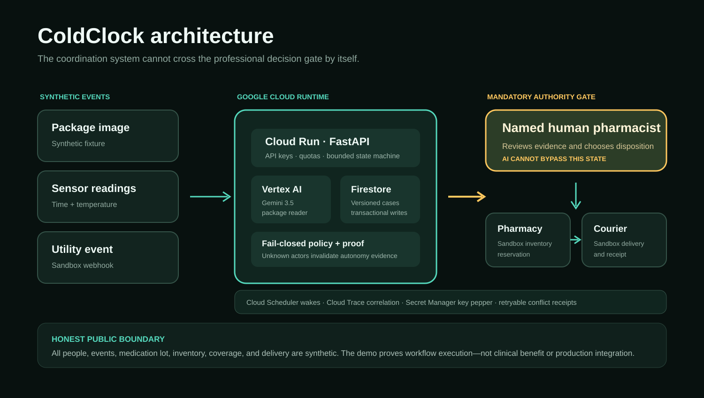

# ColdClock

Release proof: [validation evidence incl. live scheduler closure](VALIDATION_EVIDENCE.md) · [Devpost text](DEVPOST_DESCRIPTION.md) · [2026-08-22 release audit](RELEASE_AUDIT_2026-08-22.md) · [bonus ledger](BONUS_SCORE_LEDGER.md) · [impact evidence scorecard](IMPACT_EVIDENCE_SCORECARD.md) · [real-world validation protocol](EXTERNAL_VALIDATION_PROTOCOL.md) · [live model contract](https://cold-clock-109051079423.us-central1.run.app/api/model-evidence)

> When refrigeration fails, the alarm is only step one.

## Sixty-second judge path

1. Open https://cold-clock-109051079423.us-central1.run.app and click **Run unattended**. Live Gemini reads the synthetic package, Gemma screens it, the embedding model routes it, and the Google ADK agent assembles the pharmacist packet through scoped tools (~15 s).
2. Click **Record human disposition** and enter a name, a disposition, and a rationale — the only decision the system will not make.
3. Take your hands off. Reservation and dispatch are automatic; the **Durable wakes** panel shows `courier_status_poll · pending`; within about two minutes Cloud Scheduler fires it and the case reads **Closed by a Cloud Scheduler wake — no operator**. The panel also shows when the scheduler last called, with its verified identity.
4. Click **Simulate grid outage**: one event, three enrolled households, each armed with its own background watch.
5. Open the signed autonomy proof from the timeline footer; `POST /api/receipts/verify` proves it is untampered. `/api/proof` (8/8) and `/api/hardening/proof` (17/17) are executable.

ColdClock is an event-driven agent that carries a temperature-sensitive medication case from a
power or refrigerator failure to **pharmacist-reviewed resolution**. It assembles observed evidence,
routes a bounded review packet, and—only after a qualified human decision—coordinates a synthetic
replacement through delivery and receipt.

**Hackathon track:** The Taskmaster  
**Google models:** Gemini 3.5 Flash (package reader and ADK packet agent), Gemini Embedding 001 (evidence routing), Gemma 4 (injection screen) — all live on Vertex AI  
**Google agent frameworks:** Google ADK (review-packet agent with scoped tools) and Google Gen AI SDK  
**Google Cloud:** Cloud Run, Firestore, Cloud Scheduler, Pub/Sub, Cloud Trace, Secret Manager  
**Public-data policy:** The demo uses fictional people, medicine lot, pharmacy, coverage plan,
courier, reviewer, and sensor events.

## Live stack proof

The header's **Live stack** control reads `/health` at runtime. It turns green only on a healthy non-local deployment; hover, click, or keyboard focus reveals the services actually used: Gemini 3.5 Flash, Gemini Embedding 001 and Gemma 4 on Vertex AI, Google ADK, Google Gen AI SDK, Cloud Run, Firestore, Cloud Scheduler, Pub/Sub, Cloud Trace, and Secret Manager. `/health` also carries `background_worker` — the last Cloud Scheduler scan time and verified identity — and `GET /api/background/status` exposes the same without console access.

## Autonomy contract and design identity

A sensor excursion automatically verifies and routes the reviewer packet; the single qualified disposition automatically resumes reservation and dispatch; and a **durable Cloud Scheduler wake polls the sandbox courier at the ETA and closes the case with nobody at a screen**. ColdClock stops only for the clinical authority it cannot own. The UI is intentionally an ambient clinical instrument: cool telemetry color, rounded monitoring surfaces, a live autonomy rail, and a durable-wakes panel that updates by itself as the background worker acts.

Two demo entry points exist:

- `POST /api/demo/full` — the whole story in one server request, receipt included (a synthetic tabletop).
- `POST /api/demo/unattended` — every safe transition, then **stop at the courier ETA**. The receipt is deliberately not fabricated. Cloud Scheduler calls the OIDC-protected worker every minute; the `courier_status_poll` wake fires at the ETA, the sandbox courier reports the handoff, and the case resolves. `GET /api/cases/{case_id}/wakes` shows the wake go `pending → done`; the autonomy proof reports `closed_by_background_wake: true` and `cloud_scheduler_triggered_executions: 1`.

The demo clock is simulated and forward-only (stated in the UI, never hidden). "Advance simulated clock" moves time without running anything; the next scheduler scan does the work.

### One outage, every household

Real outages are not one case at a time. `POST /api/demo/outage-fanout` (or a real message on the `cold-clock-utility-events` Pub/Sub topic) applies one grid event to **every** monitoring case in the service area and arms an `outage_watch` wake per case. Fifteen minutes later the background worker judges each case from its own readings: out-of-range readings become a recorded excursion routed to review; readings still in range keep a bounded watch; a sensor that stays silent becomes a safe stop for incomplete evidence. No operator opens any case, and no case ever gets a medication decision from the system.

### The review packet is assembled by an agent — and checked

On the deployed service the pharmacist packet is assembled by a **Google ADK** `LlmAgent` (Gemini 3.5 Flash) that can only see the case through three scoped, read-only tools: verified package fields, the excursion observation, and the label storage excerpt. A verifier then compares every packet value to what the tools returned and rejects a question that asserts safety. An invented value, an editorialised question, or a skipped tool rejects the whole packet and the deterministic packet is routed instead, with the rejection recorded in `packet_agent`. The workflow never depends on the model being right — only on it being checkable.

### Receipts you can verify

`GET /api/cases/{id}/autonomy-proof` is HMAC-signed with the Secret Manager pepper. `POST /api/receipts/verify` tells anyone holding a copy whether it is authentic; change one field and it fails.

## From reproducible proof to operational pilot

The public Cloud Run workspace is intentionally signup-free for hackathon evaluation and accepts synthetic inputs only. It supports multiple durable cases and typed event ingestion without inviting real patient information. New cases use complete random UUIDs, destructive global reset is disabled, and internal scheduler workers remain OIDC-authenticated. A real-data deployment would be a separate protected partner environment.

The deterministic sample remains available because reviewers and maintainers need a repeatable safety
case. It is no longer the only product path. The running application also provides a persistent
multi-case queue and an input-driven pilot API at `/api/pilot`:

- create a synthetic monitored case from supplied package facts on the public service;
- retain fields only when they appear verbatim in the supplied transcription;
- attach the authoritative label URL, exact storage excerpt, and human-configured monitoring range;
- ingest real event-shaped sensor payloads exactly once by device event ID;
- calculate observed duration and temperature range without producing a medication disposition;
- require a named qualified reviewer to enter the disposition and independent rationale;
- preserve every case in Firestore instead of clearing global state when the page opens.

`GET /api/pilot/readiness` states what works and what remains before PHI or clinical deployment.
The public service is currently a **synthetic operational pilot**, not production clinical software. An authorized de-identified mode is disabled by default and belongs only in a private, identity-controlled deployment. See the
[startup-readiness audit](STARTUP_READINESS.md) for the identity, compliance,
integration, validation, and operating controls still required.
## The one-sentence distinction

A monitoring product tells someone that the temperature changed. ColdClock executes the fragmented
work that follows while keeping medication-use authority with a qualified professional.

## Why this problem is credible

- FDA disaster guidance explains that extended refrigeration loss can affect temperature-sensitive
  medicine and directs patients to pharmacists, healthcare providers, or manufacturers for product-
  specific guidance: [FDA, Safe Drug Use After a Natural Disaster](https://www.fda.gov/drugs/emergency-preparedness-drugs/safe-drug-use-after-natural-disaster).
- CDC provides emergency insulin-storage precautions and advises clinical involvement when switching
  insulin products: [CDC, Managing Insulin in an Emergency](https://www.cdc.gov/diabetes/articles/managing-insulin-in-emergency.html).
- A Cochrane review found that stability evidence and recommendations vary by formulation,
  temperature, time, and evidence source: [Thermal stability and storage of human insulin](https://pubmed.ncbi.nlm.nih.gov/37930742/).
- Communities affected by Hurricane Maria reported difficulty refrigerating medicine and disposal
  of insulin during extended outages: [community impact study](https://pmc.ncbi.nlm.nih.gov/articles/PMC9664670/).
- The QChainMED pilot demonstrates the feasibility of continuous home monitoring and gives us a
  clear prior-art boundary: [QChainMED pilot](https://pmc.ncbi.nlm.nih.gov/articles/PMC13039186/).

These sources support the problem and design choices. They do **not** validate ColdClock or prove
that it improves clinical outcomes.

## What the running workflow does

```text
synthetic package + normal sensor
              |
              v
      power / sensor event
              |
              v
 verified package + label + temperature evidence
              |
              v
     named human pharmacist gate
              |
      approved disposition?
        /             \
      no               yes: replace
  safe stop                 |
                            v
              sandbox inventory reservation
                            |
                            v
                accessible courier dispatch
                            |
                            v
                     receipt proof
```

The public demonstration implements seven visible workflow states:

1. `monitoring`
2. `excursion_detected`
3. `awaiting_professional_review`
4. `replacement_approved`
5. `fulfillment_prepared`
6. `delivery_dispatched`
7. `resolved`

Out-of-order actions return HTTP `409`. No route exists to prescribe, diagnose, declare medicine
safe, or tell a patient to discard it.

## Safety contract

- The model reads packages and assembles evidence. It never chooses the medication disposition.
- Package text is untrusted. A deterministic pattern layer and a Gemma 4 second layer quarantine
  instruction-shaped spans (visibly, with the span shown) before the text reaches routing or a
  reviewer. Gemma's answer is a list of verbatim spans; its prose is never used. If Gemma is
  unavailable the receipt says so and the pattern layer stands alone.
- Fulfillment is impossible until a supported disposition is recorded by a named human reviewer.
- Unsupported, missing, or conflicting evidence causes a stop rather than an inferred answer.
- Every package value retained by the reader has an exact quote in the model's transcription.
- The public pharmacy, insurance, courier, patient, reviewer, sensor, and utility connectors are
  explicitly synthetic and sandboxed.
- No endpoint claims clinical approval, prescription, production integration, or outcome benefit.

## Architecture

The customer-facing application intentionally omits rubric language, test counts, infrastructure pages, and judge-only navigation. Technical and submission reviewers can verify the same claims through the architecture below, the API documentation at `/docs`, the executable proof endpoints, `TECHNICAL_DESIGN.md`, and `VALIDATION_EVIDENCE.md`.



Primary case writes use optimistic record versions inside Firestore transactions. A stale concurrent sensor, reviewer, fulfillment, or wake update is rejected with a retryable HTTP 409 rather than silently overwriting newer evidence. Autonomy receipts also fail closed: an unknown actor is reported as unclassified and invalidates the proof instead of being counted as an agent.

| Layer | Running implementation |
|---|---|
| Interface | Responsive, keyboard-operable light/dark operations workspace |
| API | FastAPI with a typed, bounded state-transition contract |
| Event ingress | Pub/Sub push subscriptions (`cold-clock-sensor-events`, `cold-clock-utility-events`) with Google-signed OIDC into `/internal/events/*`; the same verifier as the scheduler worker |
| Agent logic | Package evidence, guardrail, excursion evidence, ADK review-packet agent with scoped tools and verifier, fulfillment, logistics, background wake, and audit roles |
| Models | Gemini 3.5 Flash live package reader; Gemini Embedding 001 evidence routing; Gemma 4 injection screen. Deterministic replay is restricted to tests |
| Persistence | Memory locally; Firestore adapter with optimistic record versions in Cloud deployment mode |
| Background execution | Cloud Scheduler → OIDC-verified `/internal/wakes/scan` every minute → transactional wake claim → idempotent action (courier poll closes the case; reminders surface stalls) |
| Compute | Dockerized Cloud Run service |
| Evidence | DailyMed structured label URL, observed sensor fixture, named human approval, receipt proof |

The roles are modular application boundaries. This repository does not claim that every logical
role executes under a separate IAM identity.

## Repository map

```text
cold-clock/
  PLAN.md                         research, differentiation, safety, UX and release plan
  README.md                       public technical and product guide
  TECHNICAL_DESIGN.md             as-built architecture and boundaries
  PROJECT_DIFFERENTIATION.md      direct prior-art comparison
  VALIDATION_EVIDENCE.md          measured checks and remaining validation
  SUBMISSION_KIT.md               Devpost copy and video spine
  docs/architecture.svg           technical architecture diagram
  app/
    cold_clock/
      workflow.py                 safety-bounded state machine
      followups.py                idempotent durable-wake registration per state
      wake_actions.py             Cloud Scheduler worker actions (courier poll, outage watch, reminders)
      outage.py                   utility-outage fan-out and per-case evidence judgment
      packet_agent.py             Google ADK review-packet agent, scoped tools, verifier
      injection_screen.py         pattern + Gemma 4 quarantine of untrusted package text
      reader.py                   live Vertex + replay package reader
      store.py                    memory and Firestore adapters
    service/
      main.py                     Cloud Run/FastAPI entry point
      routes.py                   public API, proof, signed receipts and conformance endpoints
      events_routes.py            Pub/Sub push ingress for sensor and utility events
      scheduler_routes.py         OIDC-verified Cloud Scheduler wake worker
    fixtures/                     adjacent synthetic recording and truth
    scripts/
      demo_flow.py                executable 17-step acceptance path (incl. background closure)
      check_a11y.py               static accessibility gate
      record_package.py           explicit live Gemini recording and grading command
      record_injection_screen.py  explicit live Gemma recording and grading command
      publish_event.py            publish a synthetic sensor or utility event to Pub/Sub
    infra/
      provision_scheduler.ps1     every-minute OIDC Cloud Scheduler job
      provision_pubsub.ps1        topics and OIDC push subscriptions
    tests/                         domain, API, reader, claims, UI and safety tests
    web/                           customer-facing product experience
    Dockerfile
    deploy.sh
```

## Run locally

```powershell
cd app
python -m pip install -r requirements.txt
python -m uvicorn service.main:app --host 127.0.0.1 --port 8000
```

Open:

- Product: `http://127.0.0.1:8000/`
- API: `http://127.0.0.1:8000/docs`
- Executable safety proof: `http://127.0.0.1:8000/api/proof`
- Adversarial hardening proof: `http://127.0.0.1:8000/api/hardening/proof`

## Verify

```powershell
cd app
python -m pytest -q
python scripts/check_a11y.py
python scripts/demo_flow.py --url http://127.0.0.1:8000
# against the deployment, wait for the real Cloud Scheduler tick instead of advancing the clock:
python scripts/demo_flow.py --url https://cold-clock-109051079423.us-central1.run.app --wait-for-scheduler 180
```

Current local baseline on August 25, 2026:

- `158 passed`
- `10/10` static accessibility checks
- `21/21` executable HTTP acceptance checks, including zero-click background closure, signed receipts and outage fan-out
- `8/8` foundational safety proof and `17/17` adversarial hardening proof

Those counts must be rerun after any code or copy change.

## Gemini recording policy

The adjacent recording was produced by a live Vertex AI Gemini 3.5 Flash call on the synthetic PNG
fixture and matched `4/4` exact expected fields. Every retained field has a verbatim transcription
quote. The deployed one-request workflow calls Vertex AI live and fails closed if model evidence is unavailable; recorded fixtures remain test-only.

To repeat the recording:

```powershell
$env:GOOGLE_CLOUD_PROJECT="your-project"
python scripts/record_package.py --image web/package-fixture.png
```

The script calls Gemini 3.5 Flash explicitly, validates every quote, grades extracted values against
`fixtures/package.truth.json`, and overwrites the recording only after a successful response. The
resulting accuracy may be published only after reviewing the generated report.

The Gemma injection screen has the same discipline. `python scripts/record_injection_screen.py`
makes live Gemma 4 calls on a clean label and two poisoned labels (instruction override plus a
fabricated "safe to use" claim; role reassignment plus a tool call) and grades them. The committed
`fixtures/injection.recording.json` scored `3/3` on August 25, 2026: the clean label passed both
layers, and every injected span was quarantined while the medicine facts survived.

## Deploy to Google Cloud

```bash
cd app
export GOOGLE_CLOUD_PROJECT="your-project"
./deploy.sh
```

Then provision the background triggers once:

```powershell
.\infra\provision_scheduler.ps1   # every-minute OIDC wake scans
.\infra\provision_pubsub.ps1      # sensor and utility topics with OIDC push subscriptions
python scripts\publish_event.py utility --service-area grid-7   # a real Pub/Sub message, end to end
```

`deploy.sh` keeps one instance warm (`--min-instances 1`, override with `COLD_CLOCK_MIN_INSTANCES=0` to run at zero idle cost) and the service pre-imports the ADK stack at boot, so a judge's first click is ~15 s rather than ~50 s. The public demo endpoints are capped at 30 model-backed runs per network per hour (`X-Demo-Remaining` header); the keyed `/v1` API has its own quota.

Deployment enables Firestore through `USE_FIRESTORE=true`. Before recording the submission video:

1. Confirm `/health` shows the intended Google Cloud project and `firestore` persistence.
2. Run the executable demo against the public `.run.app` URL.
3. Capture the Cloud Run revision and Vertex AI evidence.
4. Confirm public unauthenticated access from a clean browser.
5. Keep every sandbox label and live-model receipt visible.

## Research ledger

| Source | What it supports | What it does not support |
|---|---|---|
| [FDA disaster guidance](https://www.fda.gov/drugs/emergency-preparedness-drugs/safe-drug-use-after-natural-disaster) | Temperature-sensitive medicine problem and professional escalation | ColdClock efficacy or a product-specific disposition |
| [CDC insulin guidance](https://www.cdc.gov/diabetes/articles/managing-insulin-in-emergency.html) | Emergency precautions and clinical involvement | A universal discard threshold |
| [Cochrane review](https://pubmed.ncbi.nlm.nih.gov/37930742/) | Evidence variability and uncertainty | Automated clinical decision-making |
| [Hurricane Maria study](https://pmc.ncbi.nlm.nih.gov/articles/PMC9664670/) | Real access and refrigeration disruption | A current prevalence estimate |
| [QChainMED pilot](https://pmc.ncbi.nlm.nih.gov/articles/PMC13039186/) | Home-monitoring feasibility and prior art | Full replacement coordination |
| [NHS SPS excursion workflow](https://sps.nhs.uk/articles/managing-temperature-excursions/) | Professional workflow inspiration | U.S. regulatory authority or patient self-assessment |
| [DailyMed fixture label](https://dailymed.nlm.nih.gov/dailymed/drugInfo.cfm?audience=consumer&setid=72cfe377-52f6-0348-fc71-5d4ac1992ffb) | Current fixture-specific storage evidence | The review disposition for this synthetic event |

## Known limitations and next validation

- One synthetic medicine fixture does not establish general medication coverage.
- Live structured-label retrieval still needs caching, version checks, and failure-mode testing.
- A pharmacist must review the packet, terminology, dispositions, and safe-stop behavior.
- Real pharmacy, coverage, and delivery integrations require contracts and authorization.
- Accessibility still requires rendered browser, keyboard, and assistive-technology review in
  addition to the static gate.
- No clinical, economic, or public-health outcome claim is made.

## Non-endorsement

ColdClock is an independent hackathon prototype. The FDA, CDC, NIH/NLM, DailyMed, NHS, source
authors, medication manufacturers, pharmacies, insurers, and couriers do not endorse it.

## August 16 hardening

ColdClock now includes transactional Firestore wake claims, a persistent simulated demo clock, bounded retry/dead-letter behavior, Cloud Trace correlation, and explicit recovery paths for missing sensor history, unavailable review, unavailable matching stock, and courier failure. The API exposes both executable proof suites. These controls strengthen execution evidence; they do not establish clinical effectiveness.

## August 25 agentic release (second pass)

Google ADK now assembles the review packet through scoped tools with a post-model verifier; Pub/Sub push ingress carries sensor and utility events with the same OIDC verification as the scheduler worker; one grid outage fans out to every enrolled case and each is judged by its own background wake; autonomy receipts are HMAC-signed and verifiable. Hardening proof 12 → 17, acceptance 17 → 22, tests 143 → 158.

## August 25 background-closure release

The headline demo no longer fabricates the receipt inside the request. `POST /api/demo/unattended` stops at the courier ETA and the Cloud Scheduler worker closes the case; the UI polls the case and its durable wakes so the closure is visible without a refresh. Gemma 4 joined as a second-layer injection screen on untrusted package text. The hardening proof grew from 8 to 12 checks (unattended stop, zero-click closure, follow-up cancellation, quarantine) and the acceptance script from 12 to 17.

## Findings and learnings

- The most valuable behavior is continuity across evidence, authority, inventory, accessibility and receipt, not a temperature prediction.
- Finishing a workflow in one HTTP request is not autonomy; the case has to close while nobody is watching. Moving the receipt from a click to a scheduler-fired courier poll was the change that made the autonomy proof count real background executions.
- A wake-fired timeline entry with an unlisted actor silently breaks a fail-closed autonomy proof. Naming the worker as an agent, and testing the proof after a wake fires, caught that.
- A small model is a good second opinion on untrusted text when its output is constrained to verbatim spans that must exist in the source; that makes the answer checkable and keeps the model out of every decision.
- Exact-quote extraction is useful only when rejected fields stay visible and incomplete history becomes a safe stop.
- Durable action needs deterministic registration, transactional claiming and idempotent action records.
- This validates one synthetic package workflow, not medication coverage or clinical benefit.

## Originality and reused-code disclosure

ColdClock's domain workflow, UI, fixtures, evaluation, failure laboratory, research and submission materials were created for this contest-period submission. Generic clock, wake, observability, quarantine and verifier primitives were adapted from the entrant's Day Three contest-period production spine. They are disclosed in app/spine/__init__.py and independently tested here.

## Automated background execution

The deployed `cold-clock-wake-scan` Cloud Scheduler job calls the internal wake worker every minute with a Google-signed OIDC token from the dedicated `agent-wake-scheduler` service account. The application verifies audience, issuer, email and email verification before scanning. Unauthenticated calls return HTTP 401. The worker claims Firestore wakes transactionally, executes idempotent actions, bounds retries and retains dead letters. Reproduce or update the job with `app/infra/provision_scheduler.ps1` after deployment.

Three wake kinds exist, all registered idempotently by `cold_clock/followups.py`:

| Wake | Due | What the worker does |
|---|---|---|
| `courier_status_poll` | sandbox courier ETA | Polls the courier; on a confirmed handoff, records the receipt, resolves the case, and cancels the receipt reminder (marked, never deleted) |
| `outage_watch` | 15 min after a grid outage, up to 3 rechecks | Judges the case from its own readings: excursion → review routed; in range → keep watching; silent → safe stop |
| `review_followup` | 30 min after routing | Surfaces a still-unresolved review in the backup queue; cancelled the moment a pharmacist decides |
| `receipt_followup` | 60 min after dispatch | Surfaces a still-unconfirmed delivery; never dispatches a duplicate courier |

Every execution is recorded on the case (`background_executions`) with the wake id, outcome, attempt, and the verified trigger identity (`google-oidc` from Cloud Scheduler, `simulated-advance` from the clock control). The autonomy proof counts them, and a timeline entry by the **Background wake agent** is classified automatic — an unknown actor would invalidate the proof instead.


## Public developer service

Judges can use the visual sandbox without authentication. Any developer can select **Developer key**, generate a key without creating an account, then choose **Run live API test** to send a valid synthetic `/v1/cases` request and inspect its HTTP status, remaining quota, and formatted JSON response. **API docs** opens the complete OpenAPI contract. The key is displayed once; only an HMAC digest and a keyed network fingerprint are stored. Firestore transactions enforce 50 calls per key and originating network per UTC day.

Start with [DEVELOPER_API.md](DEVELOPER_API.md), the live `/docs` contract, or `GET /api/developer`. Public input is synthetic-only; the code can accept explicitly authorized de-identified input only in a separately protected deployment. Google recommends Secret Manager for Cloud Run secrets, so `API_KEY_PEPPER` is pinned to Secret Manager version 1 rather than committed or stored as ordinary configuration: [Cloud Run secret configuration](https://docs.cloud.google.com/run/docs/configuring/services/secrets).

The judge-facing autonomy receipt is derived from the persisted timeline. It reports cumulative automatic operations, human authority events, external evidence, durable wakes, and zero operator continue-clicks; `/v1/cases/{case_id}/autonomy-proof` exposes the classified receipt.
